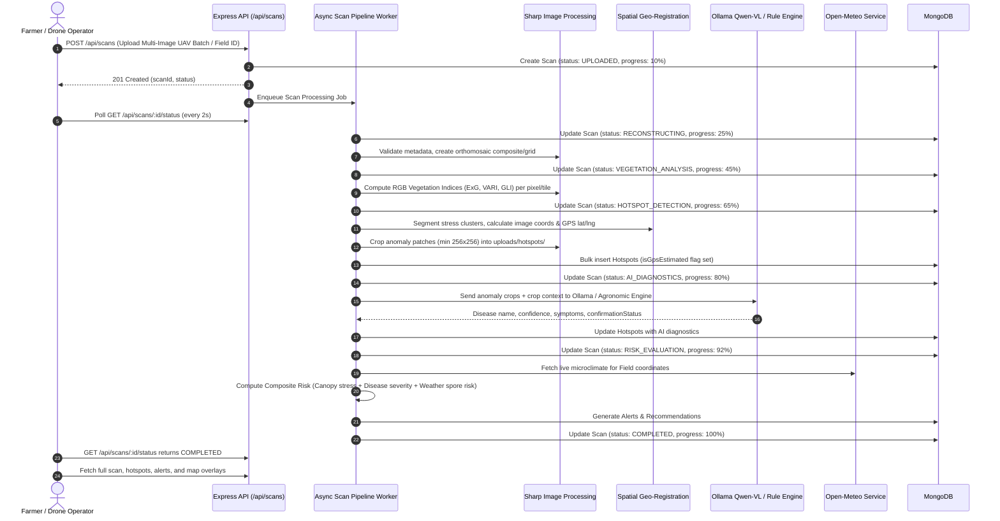
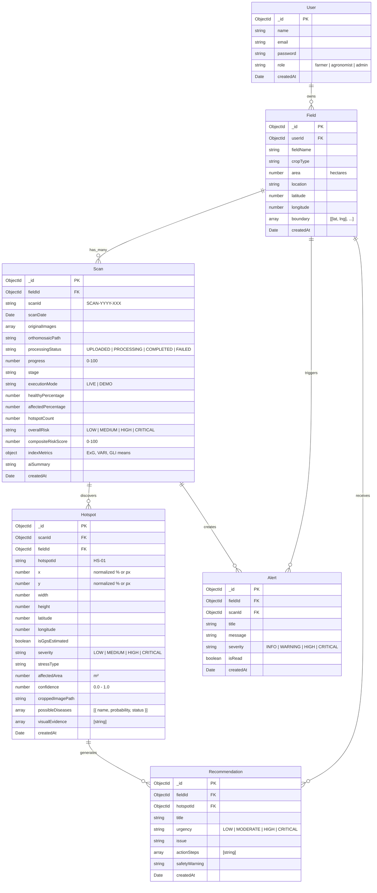

# AgriDrone AI — System Architecture & Technical Audit

## 1. Executive Summary

AgriDrone AI is an AI-powered precision agriculture platform that ingests drone imagery, reconstructs field orthomosaics, evaluates vegetation health using deterministic optical indices (ExG, VARI, GLI), detects stress anomalies and hotspot clusters, performs visual crop disease diagnostics using vision language models (Ollama Qwen-VL / agronomic rules engine), synthesizes microclimate weather risks, and delivers actionable agronomic recommendations to farmers.

This document formalizes the architectural baseline of the existing prototype, defines the production target state, and specifies the subsystem boundaries, contracts, data pipelines, and operational modes (`LIVE` vs `DEMO`).

---

## 2. High-Level System Architecture

```mermaid
graph TD
    subgraph Client Tier [React 18 + Vite + TailwindCSS + Leaflet]
        UI[Farmer SaaS Dashboard]
        MapComp[Interactive Field Map & Tile Viewer]
        ScanComp[Drone Flight Pipeline & Polling UI]
        CopilotComp[AI Agronomist Chat & Voice Copilot]
        AnalyticsComp[Longitudinal Risk & Temporal Analytics]
    end

    subgraph API Gateway [Node.js + Express REST API]
        AuthMW[JWT Auth & Role-Based Middleware]
        UploadMW[Multer Stream Uploader & Disk Storage]
        ScanRouter[Scan & Pipeline Controller]
        FieldRouter[Field & GeoJSON Boundary Controller]
        HotspotRouter[Hotspot & Anomaly Controller]
        WeatherRouter[Open-Meteo Gateway & Cache]
        AIRouter[Vision Diagnostics & Copilot Gateway]
        AlertRouter[Alerts & Push Trigger Controller]
    end

    subgraph Core Processing Pipeline [Async Job Queue & Workers]
        JobQueue[In-Memory / Async Processing Queue]
        TileWorker[Sharp Grid Tiling & Dimension Normalizer]
        IndexEngine[Deterministic Vegetation Engine ExG / VARI / GLI]
        HotspotEngine[Spatial Clustering & Geo-Registration Engine]
        WeatherEngine[Microclimate Synthesis & Spore Risk Engine]
        RiskEngine[Multi-Factor Weighted Agronomic Risk Engine]
    end

    subgraph AI & Diagnostics Subsystem
        OllamaService[Ollama Client - Qwen-VL Vision Model]
        AgronomicFallback[Deterministic Agronomic Rules & Symptom Engine]
    end

    subgraph Data & Storage Tier
        MongoDB[(MongoDB Database / Persistent Store)]
        FileStore[Local Storage / uploads: drone, tiles, crops]
    end

    UI -->|REST / Bearer Token| API Gateway
    UploadMW -->|Store Raw UAV Imagery| FileStore
    ScanRouter -->|Enqueue Job| JobQueue
    JobQueue --> TileWorker
    TileWorker -->|Crop Tiles| FileStore
    TileWorker --> IndexEngine
    IndexEngine --> HotspotEngine
    HotspotEngine -->|Crop Anomaly Patches| FileStore
    HotspotEngine --> OllamaService
    OllamaService -.->|Fallback if Offline| AgronomicFallback
    ScanRouter --> WeatherEngine
    WeatherEngine --> RiskEngine
    HotspotEngine --> RiskEngine
    RiskEngine --> MongoDB
    ScanRouter --> MongoDB
    FieldRouter --> MongoDB
    HotspotRouter --> MongoDB
```

---

## 3. Data Flow Through the Pipeline

The end-to-end processing pipeline transforms raw drone flight imagery into actionable agricultural intelligence through an 8-stage state machine:



---

## 4. Database Schema Architecture

### Entity Relationship Diagram



---

## 5. Subsystem Design & Contracts

### 5.1 Computer Vision & Vegetation Index Subsystem
*   **Scientific Constraint**: Standard UAV RGB sensors cannot produce true NDVI because they lack Near-Infrared (NIR, 700-900nm) bands. Calling RGB ratios "NDVI" is scientifically false.
*   **Spectral Limitation Notice**: In visible RGB imagery, strongly brown/senescent crop residue or foliage exhibits $r \ge g$ and $\text{ExG} \le 0.04$, which is spectrally indistinguishable from bare brown soil. The deterministic classifier classifies $r \ge g$ as non-vegetation to prevent false-positive canopy estimates on bare earth. The RGB stress classifier is calibrated specifically to detect visible green-to-yellow chlorosis, foliar lesions, and early stage leaf degradation where $g > r$ and $g > b$ hold.
*   **Deterministic RGB Indices Implemented**:
    1.  **Standard Channel Normalization**:
        $$r = \frac{R}{255.0}, \quad g = \frac{G}{255.0}, \quad b = \frac{B}{255.0}$$
    2.  **ExG (Excess Green Index)**:
        $$\text{ExG} = 2g - r - b \in [-2.0, 2.0]$$
        Accurately isolates green vegetation canopy from background soil.
    3.  **VARI (Visible Atmospherically Resistant Index)**:
        $$\text{VARI} = \frac{g - r}{g + r - b}$$
        Singularity-protected when $|g + r - b| < 10^{-5}$. Raw mathematical values are preserved without silent clamping; derived bounded values (`variClamped`) are provided for visualization/scoring.
    4.  **GLI (Green Leaf Index)**:
        $$\text{GLI} = \frac{2g - r - b}{2g + r + b}$$
        Evaluated when $2g + r + b \ge 10^{-5}$.
    5.  **Canopy Coverage**:
        $$\text{canopyCoverPct} = \frac{\text{vegetationPixels}}{\text{validPixels}} \times 100$$
        where $\text{validPixels}$ represents all valid source pixels used for spatial canopy estimation across the surveyed area ($\text{validPixels} = \text{shadowPixels} + \text{bareSoilPixels} + \text{vegetationPixels}$).
    6.  **Visual Health Score**:
        $$\text{visualHealthScore} = \text{clamp}(100 - \text{vegetationStressPct}, 0, 100)$$
        Documented as a visual crop health estimate, not a biological laboratory assay.
*   **Hotspot Extraction**: Grid tiles of 512x512 pixels undergo index thresholding. Regions exhibiting standard deviation departures $> 1.8\sigma$ from healthy baseline canopy are segmented as candidate hotspots. Sharp extracts and saves true localized bounding boxes to `uploads/hotspots/`.

### 5.2 Geospatial Coordinate Mapping
*   **Georeferenced Mode**: When EXIF GPS telemetry is present in UAV imagery, hotspot pixel centroids $(x, y)$ are projected onto geographic coordinates $(\text{lat}, \text{lng})$ using affine bilinear interpolation against field bounding vertices:
    $$\text{lat}_{hs} = \text{lat}_{min} + (1 - y) \cdot (\text{lat}_{max} - \text{lat}_{min})$$
    $$\text{lng}_{hs} = \text{lng}_{min} + x \cdot (\text{lng}_{max} - \text{lng}_{min})$$
*   **Flagging**: Each hotspot carries `isGpsEstimated: false` if anchored by real GPS/affine bounds, and `isGpsEstimated: true` if estimated from normalized container dimensions.

### 5.3 AI & Diagnostic Subsystem
*   **Primary Vision Engine**: Local Ollama server (`/api/generate`) loading `qwen3-vl:8b` or `llava`. Image patches are Base64 encoded and dispatched with a strict JSON system prompt requiring structured fields: `diseaseName`, `confidence`, `severity`, `symptoms`, `confirmationStatus` (`CONFIRMED` | `POSSIBLE` | `UNCERTAIN`).
*   **Deterministic Agronomic Rules Engine (Offline Fallback)**: When Ollama is offline or uninstalled, the system does **not** generate random numbers or fake canned diagnosis. Instead, it evaluates a deterministic crop-specific agronomic matrix based on:
    - Crop type (e.g., Tomato, Wheat, Corn, Cotton)
    - Vegetation spectral anomaly type (Chlorosis, Necrosis, Leaf Curling, Canopy Thinning)
    - Environmental humidity and temperature triggers
    - Severity and spread velocity
*   **Pesticide & Chemical Safety Constraint**: All chemical recommendations must reference authorized generic active ingredients with explicit safety warnings (e.g. "Follow local agricultural extension guidance and manufacturer label instructions; verify physically before spraying"). Never fabricate lethal dosages or proprietary mixtures.

### 5.4 Weather & Environmental Risk Synthesis
*   **Provider**: Open-Meteo Historical & Forecast API (free, open, no secret keys required).
*   **Synthesis Engine**:
    - **Fungal Spore Risk**: Evaluated using temperature (optimal $18^\circ\text{C}-28^\circ\text{C}$) and relative humidity ($>75\%$ sustained).
    - **Drought / Heat Stress**: Evaluated using consecutive high-temperature days ($>35^\circ\text{C}$) and zero precipitation.
    - **Spray Window Feasibility**: Recommends spraying when wind speed is $<15\text{ km/h}$ and rain probability $<30\%$ within 6 hours.

### 5.5 Multi-Factor Composite Risk Score
The overall scan risk is computed deterministically:
$$\text{Risk}_{\text{composite}} = 0.40 \cdot \text{StressAreaPct} + 0.35 \cdot \text{MaxHotspotSeverityScore} + 0.25 \cdot \text{WeatherSporeRisk}$$
Categorized into:
*   $\text{Risk} < 25$: **LOW** (Green)
*   $25 \le \text{Risk} < 55$: **MEDIUM** (Yellow)
*   $55 \le \text{Risk} < 80$: **HIGH** (Orange)
*   $\text{Risk} \ge 80$: **CRITICAL** (Red)

---

## 6. Execution Modes: LIVE vs DEMO

| Dimension | `APP_MODE=LIVE` (Target Production) | `APP_MODE=DEMO` (Deterministic Walkthrough) |
| :--- | :--- | :--- |
| **Purpose** | Real farm operations, genuine UAV uploads | Showcase & testing without real drones |
| **UAV Images** | Uploaded by user via multipart/form-data | Bundled sample orthomosaic & crop tiles |
| **Vegetation Analysis**| Sharp computes ExG/VARI on uploaded pixels | Deterministic analysis on bundled assets |
| **AI Diagnostics** | Ollama Qwen-VL or Agronomic Rules Matrix | Pre-computed deterministic scenario bundle |
| **Weather** | Real-time Open-Meteo query for field GPS | Real-time Open-Meteo or fixed baseline |
| **Mocking / Random** | Strictly Forbidden ($Math.random() \equiv 0$) | Prohibited ($Math.random() \equiv 0$; deterministic seed) |
| **State Transitions** | Background job worker with status polling | Background job worker with status polling |
| **UI Indication** | Status Badge: `LIVE` | Status Badge: `DEMO MODE` with Reset option |

---

## 7. Security, Reliability, and API Contracts

*   **Authentication**: Stateless JSON Web Tokens (JWT) with bcrypt-hashed passwords. Token expiration: 7 days.
*   **Error Handling**: Standardized JSON envelopes across all routes:
    - Success: `{ success: true, ...data }`
    - Failure: `{ success: false, message: string, code?: string, details?: any }`
*   **File Upload Validation**: Multer whitelist restricted to image MIME types (`image/jpeg`, `image/png`, `image/tiff`, `image/webp`). Size limits: 50MB per file.
*   **Database Resilience**: MongoDB connection retry loop with graceful fallback to `mongodb-memory-server` in development only if `NODE_ENV !== 'production'`.
